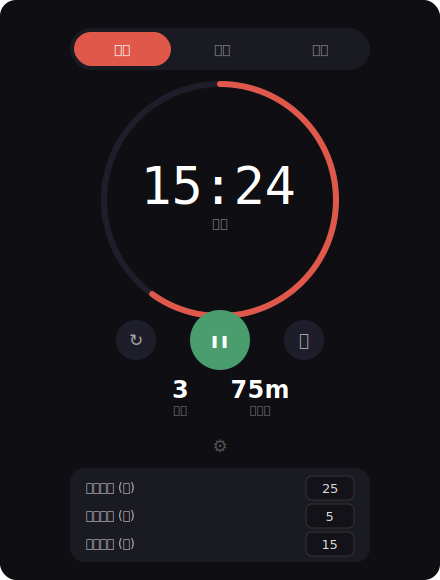

# 番茄钟 Pomodoro Timer

一个简洁优雅的桌面番茄钟，单文件 HTML，双击即用。

## 快速开始

1. 双击 `pomodoro.html` 在浏览器中打开
2. 首次点击任意位置以允许桌面通知
3. 点击中间圆形按钮开始专注

## 功能

### 番茄工作法
- **专注** — 默认 25 分钟，沉浸工作
- **短休** — 默认 5 分钟，快速放松
- **长休** — 默认 15 分钟，每完成 4 轮专注后触发

时长和长休间隔均可自定义（点击底部齿轮图标）。

### 视觉与交互
- 环形进度条实时反馈剩余时间，休息模式自动切换为绿色
- 专注结束时播放提示音（Web Audio 合成，无需加载文件）
- 浏览器原生桌面通知，切换标签页也不会错过

### 数据追踪
- 本次及历史完成的番茄数统计
- 累计专注时长记录
- 数据自动保存在浏览器 localStorage

### 键盘快捷键

| 按键 | 操作 |
|------|------|
| `空格` | 开始 / 暂停 |
| `R` | 重置当前计时 |
| `S` | 跳过当前阶段 |

## 技术

纯原生 HTML/CSS/JS，零依赖，单文件 ~30KB。
